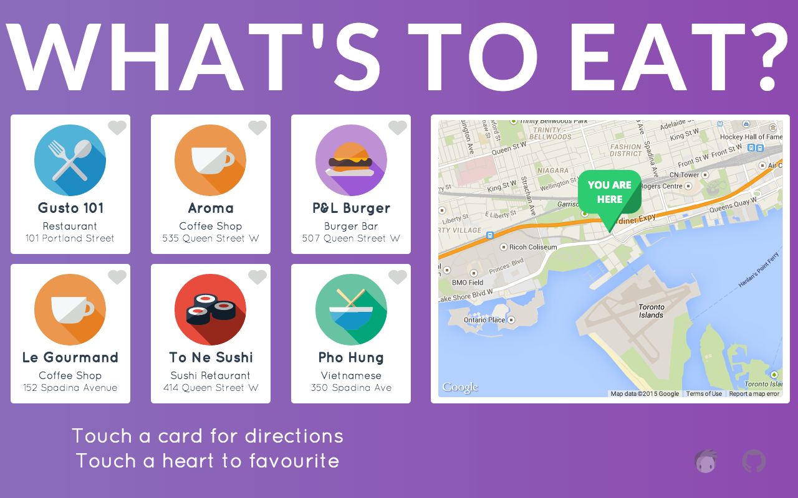

## Introduction

What's to Eat?, a customizable interactive digital display that shows user's an interactive selection of local restaurants and allows them to recommend them to other users and get directions sent to their mobile device via QR codes. You can easily change the restaurants that are displayed, as well as updating custom icons to suit the style and type of establishment. You can view a working example here http://pcsandford.github.io/whatstoeat




What's to Eat? works in conjunction with Rise Vision, the digital signage management application that runs on Google Cloud.

At this time Chrome is the only browser that this project and Rise Vision supports.


## How to use the What's to Eat Template

1. Fork or download the What's to Eat repository.


2. Modify the files as required. Please see the notes below for detailed instructions on how to modify the specific elements including restaurant names, icons, directions and the QR codes.


3. Host the entire folder directory in rise vision storage or on your web hosting service.


4. Copy the link to the index.html file where you have it hosted and insert the url into a schedule.(You can also add this link to the url gadget within a presentation)


## Directions to modify the What's to Eat Template

### Changing the Restaurant Icons 

The What's to Eat template comes with 5 different custom icons that you can add to the restaurant cards. A general 'knife and fork' icon is included as a default. To change the icons for the relative places, please locate the following line of code in the styles.css file for the number of the card you wish to change. The cards are numbered 1-6 in two rows from left to right. You can then delete
the text between the quotation marks following the src tag and replace with the file path to the desired image in the images folder. For example, you can change "images/restaurant.png" to "images/sushi.png". 

```.wrapper .cardArea .card1 .imageArea {
      width: 9vw;
      height: 9vw;
      border-radius: 50%;
      margin: 0 auto;
      margin-top: 2vh;
      background: url(../assets/images/restaurant.svg);```

### Changing the Restaurant Information - Front of Card

In order to change the restaurant information on the front of the cards, please locate the following lines of code within the index.html file and edit the text within the p tags for name, type and location for the relevant card number.

```<div class="card card1">
      <div class="front">
        <div class="heartArea"></div>
        <div class="imageArea"></div>
        <div class="name">
          <p>Gusto 101</p>
        </div>
        <div class="type">
          <p>Restaurant</p>
        </div>
        <div class="location">
          <p>101 Portland Street</p>
        </div>```

### Changing the Restaurant Information - Reverse of Card

In order to change the restaurant information on the reverse of the cards, please locate the following lines of code within the index.html file and edit the text within the p tags for the relevant card number.

```<div class="back">
        <p class="scanInstructions">Scan here for directions</p>
        <div class="codeBorder"></div>
        
        <div class="focus topRightCorner"></div>
        <div class="focus btmRightCorner"></div>
        <div class="focus btmLeftCorner"></div>
        <div class="focus topLeftCorner"></div>
        <div class="scanbar"></div>
        <p class="webAddress">www.example.com</p>
      </div>```

### Generating and Changing the QR Codes

In order to generate the QR codes to send directions to the user, please either enter the street address of the restaurant, or the Google map URL, into an online QR code generator. For this template we used http://qrickit.com/qrickit_apps/qrickit_qrcode_creator_geo.php. Once the QR code has been generated, please download and save the image and add it to the images file. Please then locate the following code within the code for the back of the card in the index.html file and replace the link to that of your unique QR code.

``` ```

### Changing the Area of the Map

To change the area that the map covers, please locate the following lines of code in the script.js file and change the longitude and latitude coordinates accordingly. Theses values can be found in the URL on the Google maps page for your location.

 ```var startPoint = new google.maps.LatLng(43.6366829, -79.4001831);```

### Changing the Directions to the Restaurants

To change the directions to the restaurants that is displayed on the Google map when the user touches the corresponding card, please locate the following code in the script.js file, and replace the addresses as required.

```var gusto101 = "101 Portland Street, Toronto";
var aroma = "535 Queen Street West, Toronto";
var pandl = "507 Queen Street West, Toronto";
var leGourmand = "152 Spadina Avenue, Toronto";
var tone = "414 Queen Street West, Toronto";
var phoHung = "350 Spadina Avenue, Toronto"; 
var resetDestination = "600 Fleet Street, Toronto";```

### Removing the Watermarks 

Please locate and delete the following code in the index.html file to remove the watermarks.

```<a href="https://github.com/pcsandford/content-template-whatstoeat" target="_blank">
    <div class="gitHubWatermark"></div>
  </a>
  <a href="http://cameroncodes.com" target="_blank">
    <div class="cameronCodesWatermark"></div>
  </a>```

## Built With

* NPM (node package manager)
* HTML5
* CSS3
* jQuery
* Grunt
* Polymer
* Google-Maps Web Components

## Submitting Issues

If you encounter problems or find defects we really want to hear about them. If you could take the time to add them as issues to this Repository it would be most appreciated. When reporting issues please use the following format where applicable:

### Reproduction Steps

1. did this
2. then that
3. followed by this (screenshots / video captures always help)

### Expected Results

What you expected to happen.

### Actual Results

What actually happened. (screenshots / video captures always help)

## Contributing

All contributions are greatly appreciated and welcome! If you would first like to sound out your contribution ideas please post your thoughts to our community, otherwise submit a pull request and we will do our best to incorporate it

### Suggested Contributions

* Further integration of Web Components
* Optimization for Portrait Display
* i18n Language Support

## Resources

If you have any questions or problems please don't hesitate to join our lively and responsive community at http://community.risevision.com.

If you are looking for user documentation on Rise Vision please see http://www.risevision.com/help/users/

If you would like more information on developing applications for Rise Vision please visit http://www.risevision.com/help/developers/.

#### Facilitator

Peter Cameron 

An Interactive Digital Display for Retail